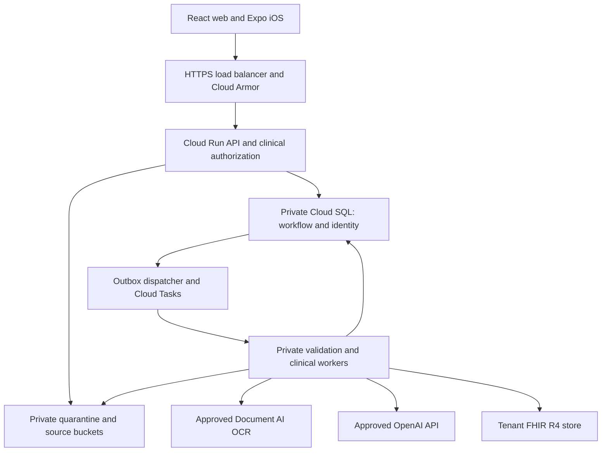

# Target architecture and clinical contracts

Everything in this document is a proposed design unless explicitly described as existing. Numeric limits and evaluation thresholds are initial engineering proposals requiring synthetic measurement and clinical validation; they are not externally mandated standards.

## Production boundaries

Keep React web and Expo/iOS clients and the Express API contracts. Replit is synthetic development only; GitHub stores source, synthetic fixtures and content-free evidence. Google Cloud hosts all production PHI processing/storage. No production PHI requests pass through Replit, its reverse proxy, developer preview, analytics or build logs.

Cloud Run API behind external Application Load Balancer with serverless NEG; constrain ingress so the run.app endpoint cannot bypass Armor. Authenticated private workers accept only task/service IAM tokens with exact audience; do not trust queue headers as authentication. Use Direct VPC egress or reviewed equivalent for private Cloud SQL and outbound policy. No public DB IP. Separate deployer, migrator, API, dispatcher, scanner, OCR, clinical reasoning, FHIR sync, sweeper and audit identities. API must not have infrastructure-admin roles.

Use Secret Manager for server credentials, keyless workload identity for GCP, and narrowly scoped GitHub OIDC federation for build/deploy. Terraform remote state uses a private dedicated bucket with locking/versioning and restricted IAM; state/plan artifacts may contain sensitive settings and are not public build artifacts. Artifact Registry stores scanned immutable container digests. Run non-root, bounded resources, minimum writable temporary area and read-only root where runtime supports it.

Use Cloud KMS for customer-managed encryption only where selected service/support/requirements justify it; baseline service encryption still requires correct IAM and rotation. Envelope keys for application fields are versioned, tenant-bound via AAD, rotated with tested recovery. Do not remove existing decryption support until all applicable data is migrated.

Clinical worker egress: approved Google API endpoints, exact OpenAI API endpoint via controlled egress, no arbitrary URL fetch or model browsing. Cloud NAT alone is not a domain allowlist; use an enforceable proxy/firewall design and test bypasses. Remote source retrieval occurs in a non-PHI knowledge-ingestion service. Consider VPC Service Controls for supported Google services as defense in depth after measuring protection against export/exfiltration; it does not govern the external OpenAI request by itself. Pub/Sub is optional for independent event subscribers, not a second redundant job queue in the first release. Cloud Scheduler triggers independent reconciliation/sweeping so API scale-to-zero does not stop cleanup. S09–S12 support platform mechanics.

## Data authority and proposed model

| Semantic type | Store and authority | Required lineage |
|---|---|---|
| ORIGINAL_SOURCE_DOCUMENT | Private immutable source object only in retained mode; customer source remains authoritative | Tenant/patient/document UUID, object generation, byte hash, source system/time, custody and retention policy |
| EXTRACTED_TEXT | Temporary output by default; retained evidence only if contracted | Source generation, extractor/version, pages, text anchors/bounding boxes, unreadable spans |
| EXTRACTED_FACT | Assertion found in text, not yet normalized or accepted | Verbatim evidence span reference, encounter/effective time, negation and subject context |
| NORMALIZED_FACT | Typed fact in clinical DB/FHIR projection | Original value/unit, normalized value/unit, code system/version, transformation/version |
| AI_INFERENCE | Versioned draft finding in workflow DB | Supporting/conflicting fact IDs, inference category, uncertainty reason, input manifest |
| HUMAN_APPROVED_FINDING | Attested review revision in clinical DB; approved projection eligible for FHIR | Reviewer identity/role, reviewed evidence, edits/rejection reasons, signature/attestation timestamp |
| FHIR_RESOURCE | Normalized interoperability representation, not automatic source authority | FHIR logical ID/version, source fact/review mapping and Provenance |
| APPLICATION_METADATA | SQL jobs/grants/config; patient-linked identifiers remain protected | Tenant ownership, transition/version and actor |
| AUDIT_METADATA | Restricted append-only event stream; may be PHI/linkable despite no prose | Actor/action/object ID/time/purpose/outcome; no original clinical text |
| REGULATORY_KNOWLEDGE | Approved non-PHI policy store | Publisher/jurisdiction/effective interval/version/source hash/approval |
| CODING_KNOWLEDGE | Licensed and approved terminology artifacts | Edition/effective interval/license constraints and activation |
| MEDICATION_KNOWLEDGE | Versioned approved medication data | Source publication/version, label or knowledge record ID, licensing and review |

Proposed additive tables: patients/identifiers/identity events; source_documents/source_versions; extracted_segments/facts/fact_revisions; jobs/job_attempts/outbox; review_manifests/reviews/findings/finding_evidence/approvals; fhir_projection_mappings; knowledge_versions/activation_events; retention_policies/deletion_requests/deletion_receipts/legal_holds. Every clinical association carries organization_id; composite FKs prevent cross-tenant linkage. Immutable revisions coexist with current-state pointers. Source content, review notes, hashes and evidence locators never enter ordinary sales history or general analytics.

## FHIR R4 semantic mapping

Validate against pinned R4 4.0.1 profiles and terminology versions. Proposed local extensions require a documented StructureDefinition; do not invent standard codes. Use provenance for transformations; source text remains separately accessible to authorized reviewers.

| Concept/resource | Intended mapping | Boundary |
|---|---|---|
| Patient | Demographics/identifiers and confirmed linkage | Internal patient ID is opaque; identifiers retain assigning system |
| Organization, Practitioner, PractitionerRole | Source/performing organization and clinician identity/role | App member role is not automatically a licensed practitioner role |
| Primary/related/comorbid diagnoses: Condition | Distinct documented conditions with verification/clinical status and evidence | Hospice episode relationship/rank belongs to a profiled episode/encounter/workflow association, not assumed universal “primary” Condition property |
| PPS, FAST, NYHA, ADLs: Observation | Separate dated assessments with instrument/version, units or coded ordinal scale and assessor | Do not infer a score from prose without marking it derived and review-required |
| Weight, nutrition, cognitive decline: Observation | Measurements and dated changes, with baseline and interval | Derived weight loss has formula, input values and units; never substitute missing baseline |
| Hospitalization/ED utilization: Encounter | Source encounters with type, dates/status | Aggregate counts are derived Observations/workflow findings, not invented encounters |
| Infections, symptoms | Condition for documented diagnosis/problem; Observation for reported/measured symptoms | Preserve negation, historical status and uncertainty |
| MedicationStatement | Reported/taken medication history | Does not imply an order |
| MedicationRequest | Actual documented medication order with prescriber/status | AI consideration never becomes an order |
| AllergyIntolerance | Documented allergy/intolerance with substance/reaction/status | Missing allergy list is unknown, not “none” |
| Labs: Observation, DiagnosticReport | Results with units/ranges/time and report grouping | Do not guess missing unit or reference range |
| Referrals: ServiceRequest | Documented referral/order | AI suggested referral remains a draft workflow finding |
| Plans: CarePlan | Source or human-approved care plan representation | No autonomous updates to EMR care plan |
| DocumentReference | Metadata and secure source reference | No public/signed-expiring URL embedded as permanent resource attachment reference |
| ClinicalImpression | Actual clinical assessment summary where semantically appropriate | Not a generic AI-output container |
| RiskAssessment | Structured risk assessment with documented method and basis | No arbitrary numeric probability; unvalidated inference stays in workflow |
| DetectedIssue | Clinically meaningful identified safety issue, reviewed as needed | Not a bucket for every documentation gap |
| Task | Interoperable clinical work request/status | Queue leases/retries remain SQL job state |
| GuidanceResponse | Result of a defined decision-support invocation when integration needs it | Model prose alone is not this resource |
| Consent | Actual consent directives and provenance where applicable | Neither a substitute for legal basis nor an authorization engine by itself |
| Provenance | Agents, source entities, transformations and target resource versions | Reviewer's attestation links exact versions, not a moving “latest” pointer |

What stays outside FHIR: UI drafts, queue attempts, billing, membership, grants, raw model envelopes, prompt versions, evaluation metrics and workflow-specific gap lists. What remains only in source records: original page layout/signatures and uncaptured details; never discard original evidence merely because extraction succeeded. See S05–S08.

## File boundary and pipeline

Default approved inputs: PDF, PNG, JPEG, TXT. DOCX remains supported only through a hardened conversion/extraction path that meets the same evidence and resource limits; disable its new clinical pipeline capability until that path is verified. Existing client gets a clear supported-format response, not silent misprocessing.

Selected OCR family: Google Enterprise Document OCR, using an explicitly pinned generally available processor version in an approved region. PDF/images follow that processor. TXT uses deterministic UTF-8 parsing with offsets. DOCX follows isolated, network-disabled OOXML validation and conversion to PDF, preserving the original and conversion provenance. Do not assume direct OCR DOCX support: current Enterprise OCR documentation describes private-preview access, while Layout Parser has different support. Do not silently enable a generative Layout Parser or preview processor. Exact processor ID/version, region, output bucket behavior and contractual coverage are deployment evidence gates, verified again at implementation. S02–S03.

Proposed launch limits: five files/job; 25 MiB/file; 100 MiB/job; 100 pages/job; 25 megapixels/image; 200 MiB total expanded DOCX; 10,000 archive entries; 100:1 compression-ratio ceiling; no nested archives (OOXML container depth one); main XML 2 MiB. Reject encrypted/password PDFs, macros/active content, embedded files, unsupported container members, inconsistent MIME/header, malformed structure, over-limit pixel dimensions and unreadable/empty extraction. Limits must be enforced while streaming/decompressing, not only against untrusted ZIP metadata. A 15-page OCR batch chunk ceiling is an application choice; verify it against selected processor-specific limits. Bound parser memory 1 GiB, CPU 30 seconds/file, wall time 60 seconds/file, scan 60 seconds, OCR stage 5 minutes, overall job 20 minutes; test legitimate charts before adopting. No truncated document may masquerade as complete evidence.

Flow: authenticate → authorize tenant/patient/purpose → allocate opaque document → stream to private quarantine with precondition create-only → validate MIME/structure/budgets → scan pinned object generation → extraction/OCR → normalize with provenance → reason over approved inputs → human review → approved persistence only in retained mode. Scanner crash/timeouts/unknown verdict fail closed. A “safe” malware verdict is not parser safety. Treat document instructions as untrusted data, exclude them from system instructions, and grant the model no external side-effect tools.

Separate quarantine/processing buckets from retained source buckets. Both private with public access prevention and uniform bucket-level access. No PHI filenames/labels/metadata. Quarantine has no versioning, soft-delete or retention lock that defeats intended expiry, verified by policy. Retained source lifecycle follows the customer contract; holds/versioning/soft-delete may be appropriate there. Use generation-match writes/deletes, immutable source versions, and scan-to-extract generation matching to prevent replacement after scanning.

Prefer current authenticated upload approach with streaming. If signed upload is later needed, scope object/method/type/size/preconditions and short expiry; do not allow a still-valid URL to recreate data after cancellation. Signed downloads require clinical.export or authorized source viewing, short expiry, attachment content type and no logging/referrer exposure; proxying is preferable for rapid revocation. Verify deletion with object generation/history inventory and provider policy, not only live-object existence. Reconcile orphan bucket objects against SQL; do not rely solely on committed DB rows.

## Durable jobs and freshness

Separate processing state, clinical review state and cleanup state. Allowed processing transitions: UPLOADED → VALIDATING → SCANNING → EXTRACTING → NORMALIZING → AI_PENDING → AI_RUNNING → REVIEW_READY. Review transitions: REVIEW_READY → APPROVED or REJECTED; source/policy changes mark affected reviews STALE. Jobs may become CANCELLED or FAILED from any running stage. Cleanup transitions: NOT_REQUIRED/PENDING → RUNNING → VERIFIED or RETRY_REQUIRED. CANCELLED must never be changed back to REVIEW_READY by a late result.

SQL is the state authority. Create job and outbox row atomically; dispatcher creates named Cloud Tasks with opaque IDs, no PHI body. Worker claims a bounded lease using compare-and-swap/version check, records attempts, heartbeats and generation fencing. Unique `(tenant, operation, idempotency_key)` plus request digest rejects key reuse with different input. Object/fact/FHIR projection writes have independent deterministic identity and conditional version checks. Provider delivery is at-least-once; exactly-once effect is implemented by idempotency and reconciliation, not claimed from task names.

Retries: at most three stage attempts for transient infrastructure errors; at most two total reasoning submissions, including SDK retries (disable hidden retry multiplication). Invalid files, policy rejection and authorization failure are nonretryable. Backoff with jitter under the total job deadline; poison jobs go to a restricted reconciliation queue. A crash around an OpenAI response can still incur duplicate cost; record attempt state and bound spend instead of promising zero duplicate inference. Cancel persists tombstone first, stops further leases, aborts requests when possible, discards late outputs and schedules deletion. A standalone sweeper drains expired jobs and inventories orphan storage; it runs independently of API replicas.

Input manifest: tenant/patient identity revision; ordered document UUID/generation/hash; extracted-fact versions; exact FHIR logical IDs/versionIds; selected source-as-of cutoff and completeness; approved policy/medication/coding bundle versions; model identifier/snapshot; prompt hash/version; output schema version; extraction/normalizer versions. Retain it only according to lifecycle mode. No bare global content hash in analytics; use tenant-keyed digest for private deduplication. Changed source, patient merge, policy activation or corrected fact emits invalidation. Check manifest again atomically at human approval, export and FHIR projection; display STALE and block “current” approval if changed. Updates do not rewrite historical signed reviews.

## Clinical AI output and medication safety

Preserve server-only API calls. Use an approved configuration manifest, no implicit default clinical model when manifest missing. Existing gpt-5 environment defaults are observations, not a recommendation to approve that model. Every model/version and endpoint must pass eligibility review and clinical evaluation. Use Responses text/structured output with store:false and approved retention/account settings. No provider-side patient conversation history, files store, vector store, background mode or hosted tools in the initial clinical path. Google-hosted OCR sends only required extracted evidence to OpenAI. Exclude PHI from public web search, knowledge ingestion and remote MCP. Verify actual BAA scope/project configuration; environment assertions alone cannot prove them. S01.

Versioned result envelope: review ID + manifest ID; patient-story summary; disease trajectory; functional/nutritional/cognitive decline; symptoms; utilization; diagnoses; medications; labs; supporting/missing/contradictory evidence; documentation/coding/billing considerations; comfort-care considerations; clinician/physician questions. Each finding has immutable ID, type, assertion, evidence references, applicable policy references, temporality, source completeness, uncertainty reason and review state. Categories: DIRECT_SOURCE_FACT, DERIVED_FACT, CLINICAL_INFERENCE; EVIDENCE_COMPLETE, EVIDENCE_PARTIAL, SOURCE_CONFLICT, HUMAN_REVIEW_REQUIRED. No model-generated numeric confidence. “Complete” is relative to the stated evidence needed for that claim and supplied inputs, never a claim that the entire chart is complete.

Evidence validator verifies tenant/patient/document/version existence, source span/page coordinates, quoted text or supported normalized transformation, and approved policy bundle. Unsupported citations reject the finding or downgrade it to explicitly ungrounded question; unsupported clinical facts never appear as confirmed. Check refusal/truncation/schema errors; retries may not manufacture evidence. A narrative summary is built from validated findings. Keep source-supported fact separate from inference and reviewer edit. Review records store approve/reject/modify per finding plus reason, signed manifest and reviewer qualifications.

Medication finding fields: symptom/problem, source evidence, current therapy, possible consideration, allergy/renal/hepatic/interaction/duplication/route/contraindication status, missing context, knowledge version and qualified prescriber review requirement. Unknown is distinct from checked-negative. RxNorm normalizes drug names, not a complete interaction engine; DailyMed provides labeling, not a validated all-drug interaction service. Obtain licensed evaluated interaction/dosing knowledge before claiming comprehensive interaction checks; otherwise report the check as unavailable. No autonomous prescribing, dose changes, orders, eligibility certification or claim submission. S13–S15.

## Clinical evaluations and approved knowledge

Create a separate synthetic clinical evaluation harness, beyond unit and source-string contract tests. Initial cohort: at least 120 clinician-adjudicated cases balanced across cancer, dementia, cardiac, pulmonary, renal, liver and neurological disease plus mixed/insufficient evidence; 20 adversarial cases can be included but must be separately reported. Include scans, poor OCR, copied text, contradictions, negation, caregiver-versus-patient statements, dates/units, uncertain identity, missing labs/allergies, renal/hepatic risk and prompt injection. Synthetic case authors and independent clinical adjudicators sign expected findings against source evidence/policies; the generating model never supplies the sole gold answer. Coding reviewed by a qualified coding reviewer, medication by prescriber/pharmacist.

Proposed pilot gates: zero wrong-patient/cross-tenant findings; zero unsupported high-impact assertions; zero autonomous diagnosis/order/certification; 100% valid evidence references for material claims; zero missed critical contraindication/allergy cases in the safety sentinel set; >=98% precision and >=95% recall on explicit extraction facts overall and >=90% per category; >=95% contradiction recall. Report denominators and confidence intervals, stratify by format/disease and severity; small samples cannot establish general safety. Any high-severity regression blocks release even if aggregate improves. Clinical lead approves final thresholds and sample adequacy before PHI pilot. Missing evidence must be tested as an expected abstention, not rewarded as an unsupported answer.

Run evaluations when model, prompt, schema, OCR, normalization, retrieval, policy, medication or coding data changes. Store synthetic cases and versioned expected evidence in GitHub; evaluation artifacts contain no real PHI. Require reproducible old/new comparison, reviewer signoff, deployment manifest and rollback to prior approved bundle. Monitor production content-free safety counters; production clinical review remains inside covered infrastructure, never copied into this harness.

Knowledge records: source publisher/URL, document ID, jurisdiction/MAC, effective interval, retrieval timestamp, edition/version, byte hash, superseded timestamp, license scope, validation evidence, reviewer/approval, activation status. Source change follows DETECT → INGEST → DIFF → VALIDATE → APPROVE → ACTIVATE. Detection cannot mutate active reasoning. Keep source documents and clinical evidence separate. Evaluate policy relevant to service date and jurisdiction, not merely newest retrieved page. Approved activation stales dependent open reviews; historical signed review remains associated with its prior bundle. Rollback is another audited activation.

CMS Medicare guidance, applicable CoPs and MAC LCDs require controlled source inventories; LCD evidence is not a universal automatic checklist or physician certification. The inspected policy helper's CMS_MCD/date test must be expanded. Coding datasets require edition/effective-date and redistribution/prompt/cache/output license review; do not bundle CPT, SNOMED, proprietary drug databases or licensed scales without rights. Track PPS and other instrument-use permissions alongside terminology. This architecture does not reproduce a clinical rulebook or certify every CMS requirement; content activation requires a scoped expert-reviewed policy pack. S13–S16.
